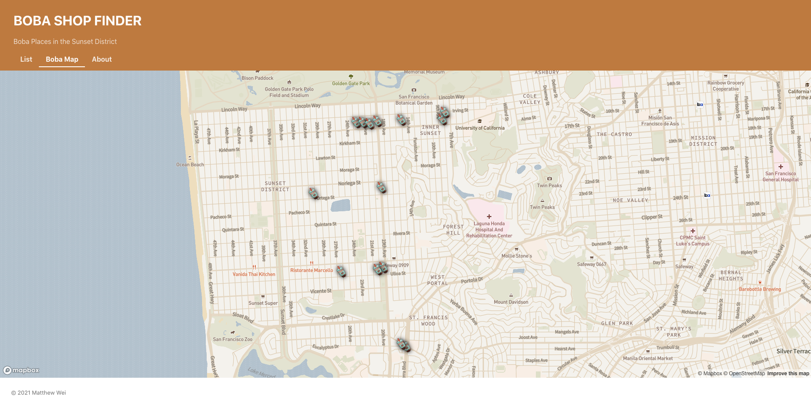

# Boba Shop Finder - Sunset District

## Description
I wanted to build a React project that I would use if it were an actual website. Since I like to drink milk tea this was a no brainer. This project challenged me since I'm new to React but I'm proud of myself for making a decent looking site.

#### FINISHED
* Plans to add more boba shops as the list is incomplete.

#### WORK IN PROGRESS
* Plans to make it responsive on phones.
* Plans to fix map on GitHub pages (Works locally).

## How to Use
1. Goto the Github Pages I currently have the boba shop finder on [here](https://matthewwei35.github.io/boba-shop-finder/#/).
2. You can look at some boba shops and click on the pictures to get more details.
3. Another page that is a boba map in which you can click on the boba icons to see what location it is.
4. There is also an about page that tells you what what boba is.

## Screenshots

